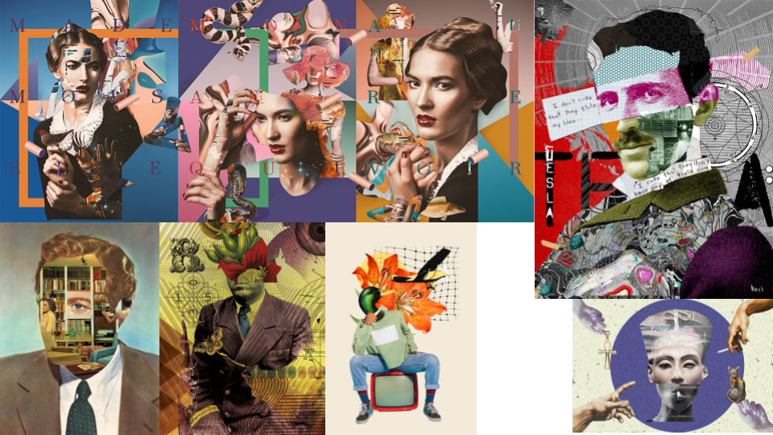
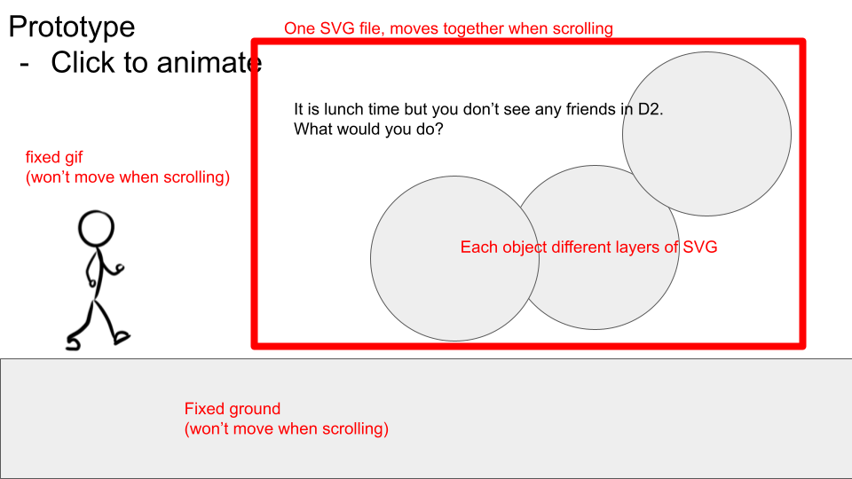
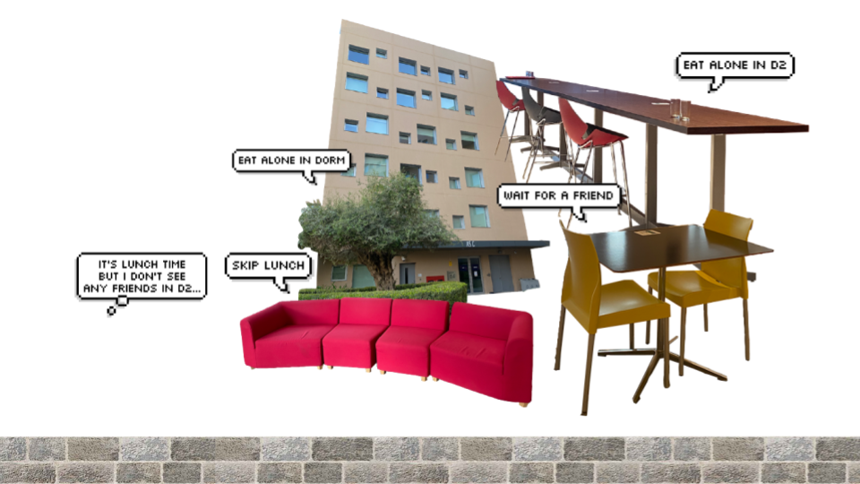
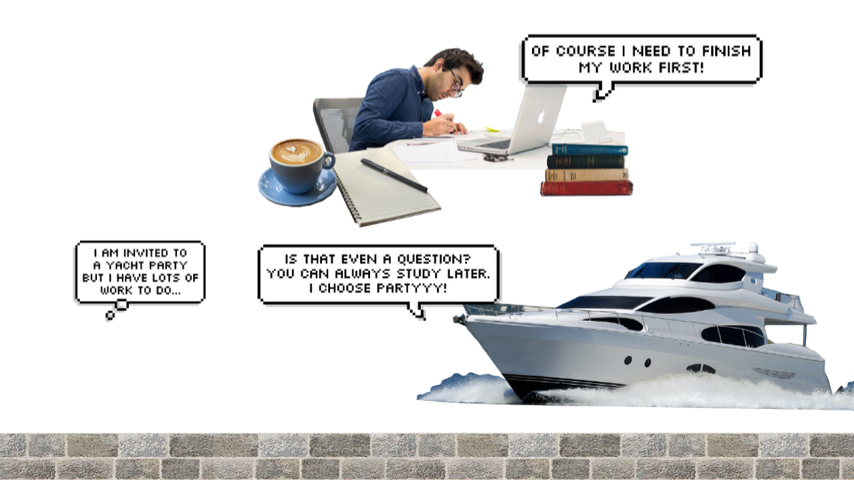

# Normalcy Test
## Are you a "normal" NYUAD student?
Have you ever wondered what is considered "normal" in NYUAD? Is it normal to eat alone in D2? Is it normal to decline party invites and choose to stay in your room? How should a "normal" student behave on this campus? "Normalcy Test" twists this belief that we must fit into the common norms. The project initially invites users to test their normalcy by answering how they would behave in the given situations. In the end, however, the website delivers a message that every individual is unique and there is no need to struggle to fit into the socially constructed normalcy. 

## Process
### Phase 1: Idea Development
The design inspiration I had was a collage of different images that delivers eccentric and comical mood. Before the first group meeting, I created the following moodboards to illustrate the visual I had in mind to other group members. Group members also liked the image collage idea so it was chosen as the main visual concept of our comic. 

After our first meeting, we decided to create a comic that could guide students' life in NYUAD in terms of time management and balancing. We all resonated with the idea that when we first came to college we all felt so confused in deciding what is normal and what is not. We wanted to make a comic that could tell people that it is completely okay to deviate from what is perceived as "normal." 

### Phase 2: Prototype Design

### Phase 3: Designing SVG Files

### Phase 4: Design Realization 

### Phase 5: Feedback and Discussion

## Reflection and Evaluation 

Process: How did you go about implementing the concept. Describe your role and what your contribution was.
Reflection/Evaluation: This should bookend the initial concept and talk about whether your expectations and goals were met in the process of building the final working version.
